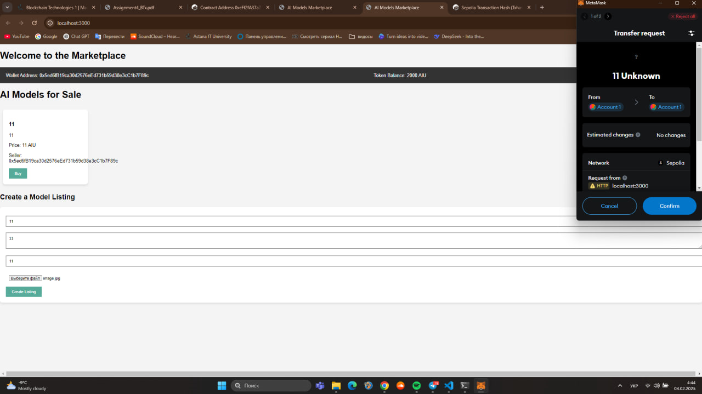
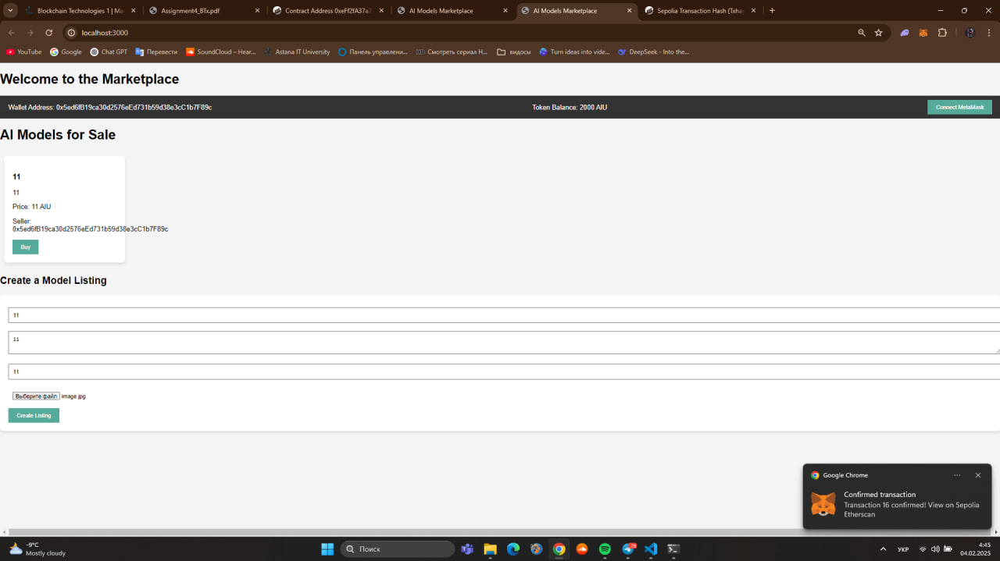
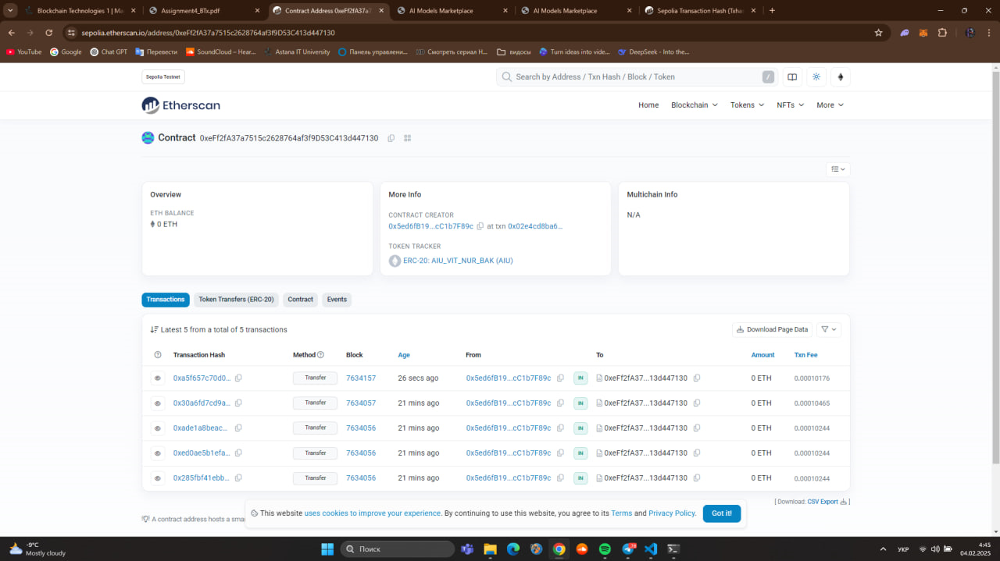
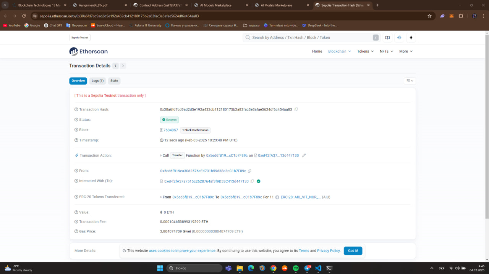

# AI Models Marketplace

This is a decentralized marketplace for buying and selling AI models, powered by blockchain technology and smart contracts on Ethereum. The marketplace allows users to upload, view, and purchase AI models securely.

## Features

- Upload AI models (files) with metadata such as name, description, and price.
- Display available AI models for sale.
- Purchase models using an ERC-20 token (AIU).
- Interaction with MetaMask for wallet connection.

## Prerequisites

Before running the project, make sure you have the following installed:

- [Node.js](https://nodejs.org/) (version 18.x or later)
- [npm](https://www.npmjs.com/) (comes with Node.js)
- [MetaMask](https://metamask.io/) browser extension
- [Quicknode](https://www.quicknode.com/) or any Ethereum test network (e.g., Sepolia)

## Setup

### 1. Clone the repository

### 2. Install dependencies

Navigate to the project directory and run the following command to install the required packages:

```bash
npm install
```

### 3. Set up the Smart Contract

- Deploy the smart contract to the Ethereum network (use a test network like Sepolia for testing).
- Make sure the contract ABI and address are updated in the front-end code (`app.js`).

### 4. Start the Backend Server

Run the backend server to handle model uploads and serve API requests:

```bash
node server.js
```

This will start the server on `http://localhost:3000`.

### 5. Start the Frontend

Open `index.html` in your browser. The front-end application allows users to view the list of models, upload new models, and purchase them using the ERC-20 token.

---

## How It Works

1. **Upload Models**: Sellers can upload AI models by providing the model name, description, price, and file. The model details are stored and displayed in the marketplace.
2. **Connect MetaMask Wallet**: Users must connect their MetaMask wallet to interact with the marketplace and make purchases.
3. **Buy Models**: Buyers can select a model to purchase. The smart contract handles the token transfer to the seller's address.

## Technologies Used

- **Ethereum Smart Contracts**: Written in Solidity.
- **Web3.js**: JavaScript library to interact with the Ethereum blockchain.
- **Node.js**: Backend server to handle file uploads and API requests.
- **Express**: Web framework for Node.js.
- **OpenZeppelin**: Open-source library used for the ERC-20 token implementation.

## License

This project is licensed under the MIT License.
- 
- 
- 
- 